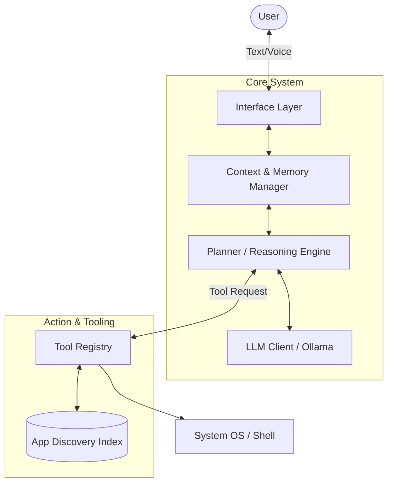

# System Automation Assistant

An AI-powered desktop automation assistant built using Python, Ollama, and Agentic AI concepts.

---

## Project Overview

System Automation Assistant (SAA) is an intelligent automation agent capable of understanding natural language commands, converting them into structured execution plans, and performing desktop automation tasks automatically.

The project aims to evolve from a simple desktop automation tool into a fully capable AI Agent that can execute complex workflows, interact through voice, and eventually support remote automation.

### Current Capabilities

* Open applications
* Search the web
* Capture screenshots
* Create folders
* Generate structured JSON commands using LLMs
* Execute automation tasks through a centralized Executor Engine
* Maintain execution logs and error tracking

### Example Commands

* Open Notepad
* Start Brave
* Search ChatGPT
* Take Screenshot
* Create folder Internship
* Create folder Reports in D:\Projects

---

## Technology Stack

### Core Technologies

* Python 3.13
* Ollama
* Local LLMs

### AI Models

* Gemma 3 (4B) - Primary command understanding model
* Llama 3 - Secondary model for testing and future advanced reasoning

### Automation Libraries

* PyAutoGUI
* subprocess
* os
* pathlib
* shutil
* webbrowser

### Future Technologies

* SpeechRecognition
* Whisper
* Vosk
* PyWin32
* Python-Docx
* ReportLab

---

## System Architecture

---

## Project Structure

SystemAutomationAssistant/

├── config/
├── data/
├── docs/
├── generated_files/
├── logs/
├── models/
├── screenshots/
├── src/
│   ├── automation/
│   ├── core/
│   ├── llm/
│   ├── tools/
│   ├── utils/
│   └── voice/
├── tests/
├── requirements.txt
├── README.md
└── main.py

---

## Current Features

### AI Agent Planning Loop

The system now runs an autonomous ReAct (Reason + Act) loop. It is capable of:
* Maintaining conversation history to understand context (e.g., "Open discord... now close it")
* Asking follow-up questions for missing information
* Generating multi-step execution plans
* Dynamically resolving vague application names (e.g., "calc" -> "calc.exe") using an App Discovery component

### Automation Engine

Supported Actions:

* open_application
* close_application
* take_screenshot
* create_folder
* search_web

### Logging System

Tracks:

* User commands
* Generated JSON
* Execution status
* Errors
* Success logs

---

## Development Roadmap

### Phase 1 — Research & Setup

* Project research
* Competitor analysis
* Architecture design
* Environment setup

Status: Completed

### Phase 2 — AI Command Processing

* Ollama integration
* Gemma integration
* JSON command generation
* Command parser
* Executor engine

Status: Completed

### Phase 3 — Smart Automation

* Better application discovery
* Context awareness
* Multi-step commands
* Action validation

Status: Completed

### Phase 4 — Voice Assistant

* Speech-to-Text
* Voice Commands
* Text-to-Speech
* Conversational interaction

### Phase 5 — Filesystem Automation

* File creation
* File movement
* File organization
* Document generation

### Phase 6 — Desktop Automation

* Mouse automation
* Keyboard automation
* Application workflows
* Browser automation

### Phase 7 — Remote Automation

* Remote commands
* WhatsApp integration
* Mobile control
* Remote execution

---

## Current Project Status

Current Completion:

Approximately 50-55%

Current Milestone:

Working AI-Powered Desktop Automation Assistant

Completed:

* Ollama Integration
* Gemma 3 Integration
* Command Parser
* Executor Engine
* Logging System
* Screenshot Automation
* Folder Creation Automation
* Web Search Automation
* Application Launch Automation

---

## Future Scope

* Fully Agentic AI workflows
* Multi-step task execution
* Vision AI integration
* Mobile application
* Remote desktop control
* Autonomous task planning
* AI-powered workflow optimization

---

## Author

Kavya Chavda
B.Tech Information Technology
CSPIT, CHARUSAT
Softwingz Infotech Internship Project
